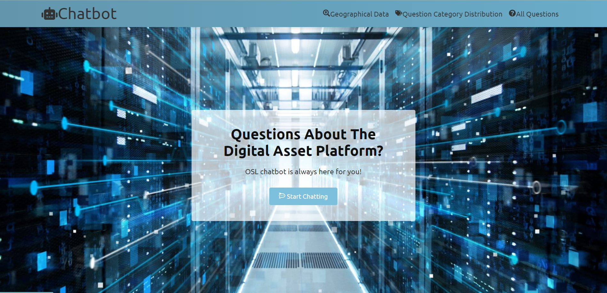
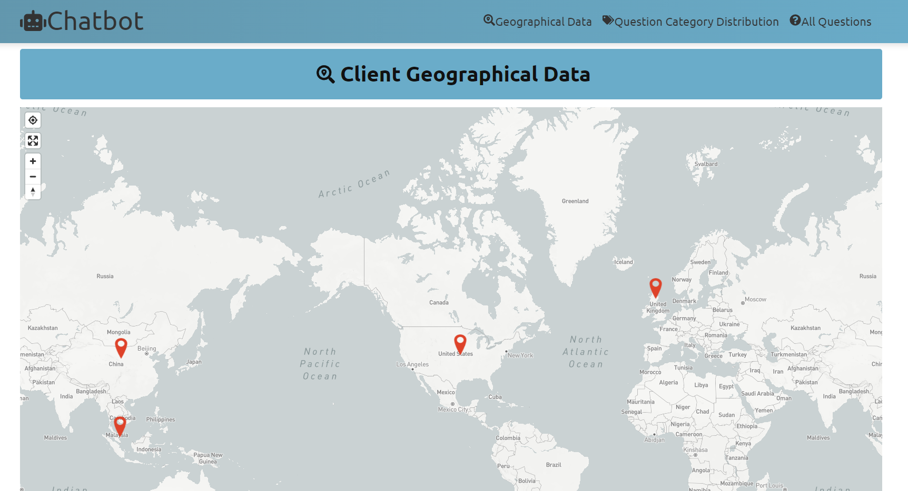
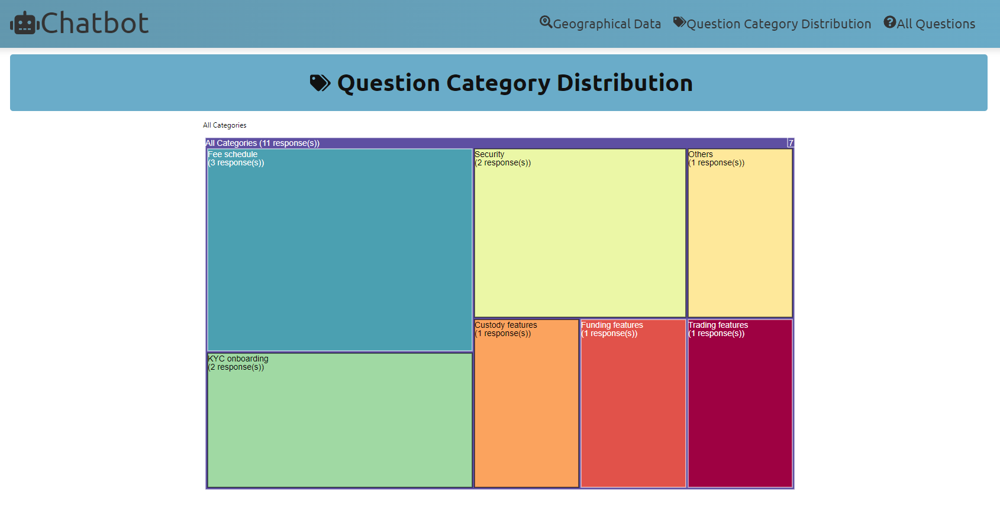
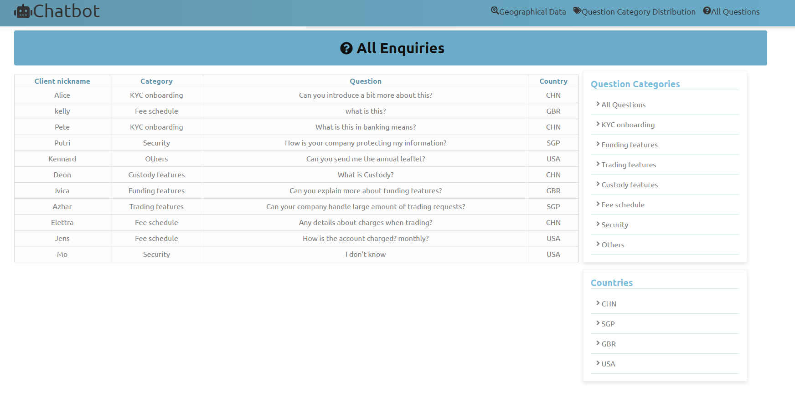
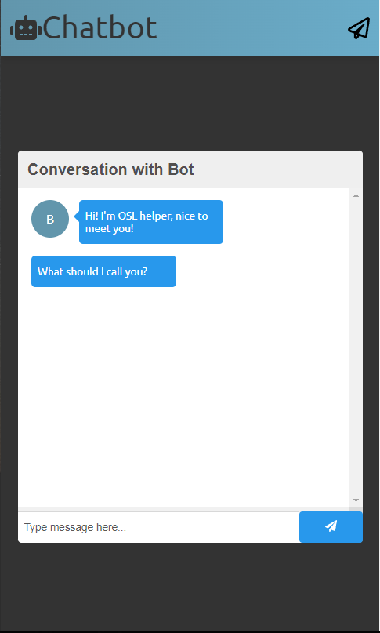
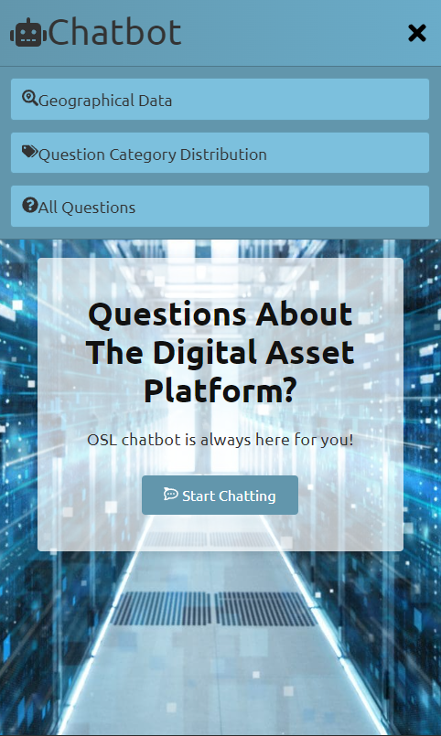
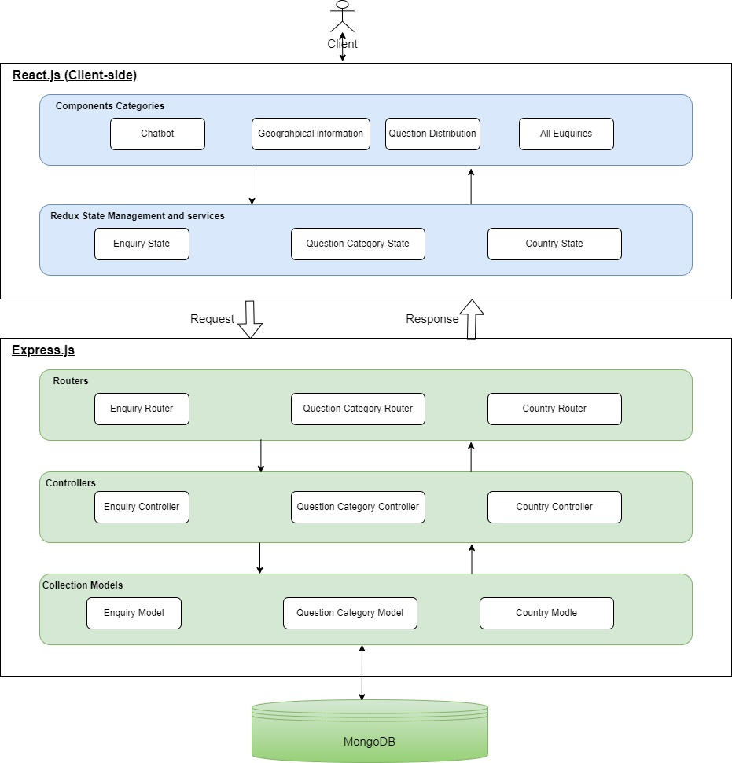
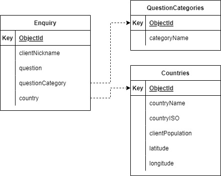

# Chatbot and Dashboard

## Demo Link

Access the project at [here](https://chatbot-and-dashboard.netlify.app/)

## Table of Content

- About the project
- Screenshots of functions demonstrated
- Technological structure
- Setup
- About Deployment

## About The Project

This project is to proof the concept of creating a FAQ chatbot and a dashboard for data analytics for customer service, sales and marketing for a trading company

## Screenshots

### Category 1 - start the chatbot

Homepage of the website


Chatbot layout


### Category 2 - dashboard for data analytics

Geographical location of clients


Client question category distribution


All of the client's enquiries


### Others - Responsive design

Responsive chat bot


Responsive navbar


## Technologies

This Project is developed using the MERN stack:

- Frontend: React.js, HTML, CSS, Redux state managemet
- Backend: Node.js runtime, Express.js
- Database: MongoDB

### Architecture view



### Database Collections



### Function requirements(FR) for this project

| FR  | Category  | Description                                                                                                                      |
| --- | --------- | -------------------------------------------------------------------------------------------------------------------------------- |
| FR1 | Chatbot   | Collect client’s nickname using a chatbot                                                                                        |
| FR2 | Chatbot   | Collect question category that the client is aiming at using a chatbot                                                           |
| FR3 | Chatbot   | Collect the client’s exact question using a chatbot                                                                              |
| FR4 | Chatbot   | Collect the client’s geographical location using a chatbot                                                                       |
| FR5 | Dashboard | Open a new page and show the client population from different countries through a geographical map                               |
| FR6 | Dashboard | Open a new page and show the distribution of the question categories through a tree map                                          |
| FR7 | Dashboard | Open a new page to display all of the questions’ details in a table, including nickname, question, question category and country |
| FR8 | Dashboard | Allow questions filter function by question category                                                                             |
| FR9 | Dashboard | Allow questions filter function by country                                                                                       |

### Non-functional requirements(NFR) number corresponding to FR above

| NFR  | Category  | Description                                                                                                                                                                                                                    |
| ---- | --------- | ------------------------------------------------------------------------------------------------------------------------------------------------------------------------------------------------------------------------------ |
| NFR1 | Chatbot   | library for implementation: react-chatbot-kit, client input tracked by react-chatbot-kit state, only accepting alphanumeric, dashes and underscore                                                                             |
| NFR2 | Chatbot   | create widgets for question categories to provide options for client to choose from, options of question categories passed from backend                                                                                        |
| NFR3 | Chatbot   | client input tracked by react-chatbot-kit state, question cannot be blank or more then 200 characters                                                                                                                          |
| NFR4 | Chatbot   | create widgets for countries to provide options for client to choose from, options for countries passed from backend                                                                                                           |
| NFR5 | Dashboard | library for implementation: react-map-gl, display the stored country information from the backend (latitude, longitude and client population) (stored as redux state after fetching using axios)                               |
| NFR6 | Dashboard | library for implementation: react-d3-treemap, create a HashMap<QuestionCategory, NumberOfResponses> to display the exact distribution from the raw data passed from backend (stored as redux state after fetching using axios) |
| NFR7 | Dashboard | Implement tables to show all of the enquiry datas (client nickname, question category, question and country) passed from backend (stored as redux state after fetching using axios)                                            |
| NFR8 | Dashboard | Questions are filtered by clicking the exact category name (displayed as list in the same page)                                                                                                                                |
| NFR9 | Dashboard | Questions are filtered by clicking the exact country ISO (displayed as list in the same page)                                                                                                                                  |

## Setup

- Download and clone the repository
- Make sure you have your devices installed with node runtime environment

### Backend setup

- Navigate to the backend folder
- Run the command "npm install" to make sure you have all the necessary backend node packages installed

```bash
cd backend
npm install
```

### Frontend setup

- Navigate to the frontend folder
- Run the command "npm install" to make sure you have all the necessary frontend node packages installed

```bash
cd frontend
npm install
```

After all the packages are installed, run the "npm start" command in the frontend directory

```bash
npm start
```
## About Deployment
The deployment is separate in terms of frontend and backend
- Backend: heroku, access at [here](https://nodejs-chatbot-backend.herokuapp.com/)
- Frontend: netifly, access at [here](https://chatbot-and-dashboard.netlify.app/)

## Credits

OSL Hong Kong

Created By Pete, To Chun Yip | All Rights Reserved
